# 🔎 Azure Sentinel (SIEM) Honeypot Cowrie: Home Lab on Microsoft Cloud
A step-by-step guide to deploying Cowrie, an interactive SSH honeypot, in the Microsoft Azure cloud to collect data on attacker behavior, login attempts, and malicious commands.
While learning cloud services, I decided to deploy a honeypot and write a brief overview of my results. This project was inspired by the guide from portfoleyo — Azure Sentinel (SIEM) (Security Analyst) Honeypot Home Lab.

Project Stack:
* **Azure VM** (Ubuntu 24.04 LTS).
* **Network Security Group (NSG)**: Configured for traffic redirection.
* **Cowrie**: For log collection, analysis, and visualization.

---

## Step-by-Step Deployment

### Step 1: Create a Free Account
> When you sign up, Microsoft offers $200 in Azure credits for the first 30 days.
<p align="center">
  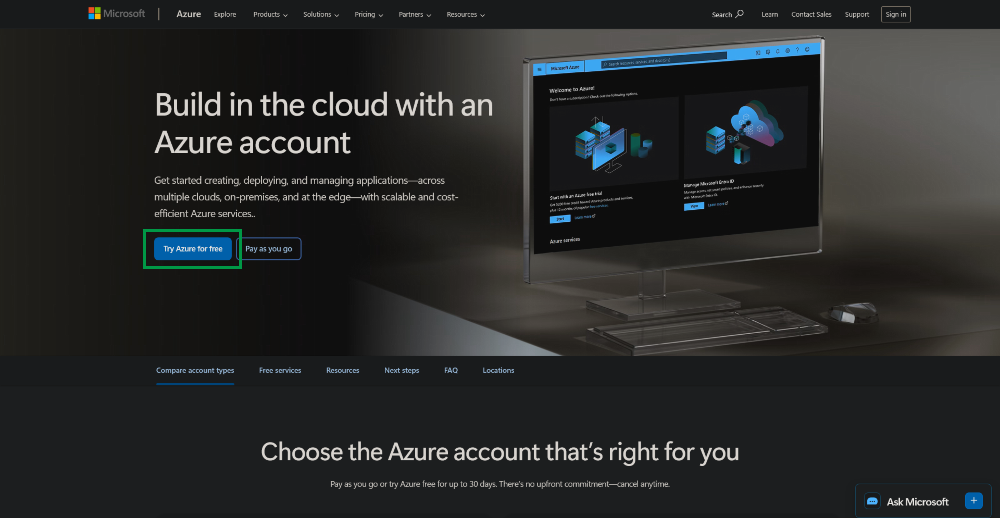
</p>

### Step 2: Find Available Regions for B2 via Bash
> The B1s tier isn't available in all regions, so we need to find regions for the B2 tier with the lowest cost. I chose B2ts. Open your terminal (e.g., WSL Ubuntu) and run the following code to find a region without restrictions for B2ts:
```bash
az vm list-skus --resource-type virtualMachines --all --query "[?starts_with(name, 'Standard_B2')].{
  Name: name,
  Locations: locations,
  Restrictions: restrictions
}" --output json
```

### Step 3: Create a Virtual Machine
> Search for Virtual Machines in the Azure portal and click Create.
<p align="center">
  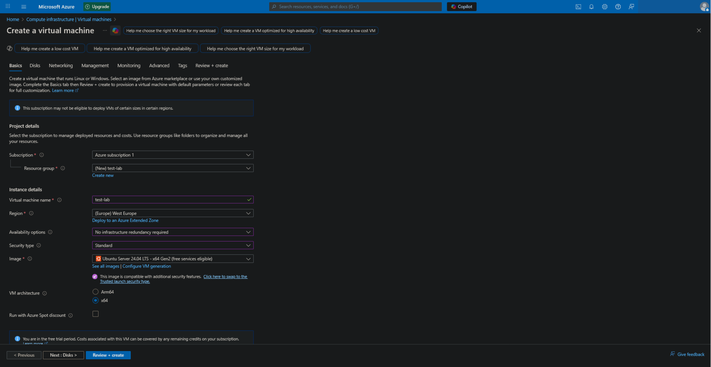
</p>

* Resource Group: Click Create new and name it (e.g., test-lab).
* Virtual machine name: test-lab.
* Region: Select a region where the image is available (e.g., West Europe).
* Availability options: No infrastructure redundancy required.
* Security type: Standard.
* Image: Ubuntu Server 24.04 LTS - x64 Gen2.
* Size: Standard_B2ts_v2.
* SSH Key Type: Ed25519 SSH Format.
* Key pair name: test-lab_key.
* Select inbound ports: SSH (22).
* In the Networking tab, ensure a Public IP is created.
* Leave other tabs at default and click Review + Create.

### Step 4: Configure Log Analytics Workspace
> Search for Log Analytics workspaces and click Create.
> This workspace acts as the monitoring hub in Azure, centralizing logs for processing and visualization.
<p align="center">
  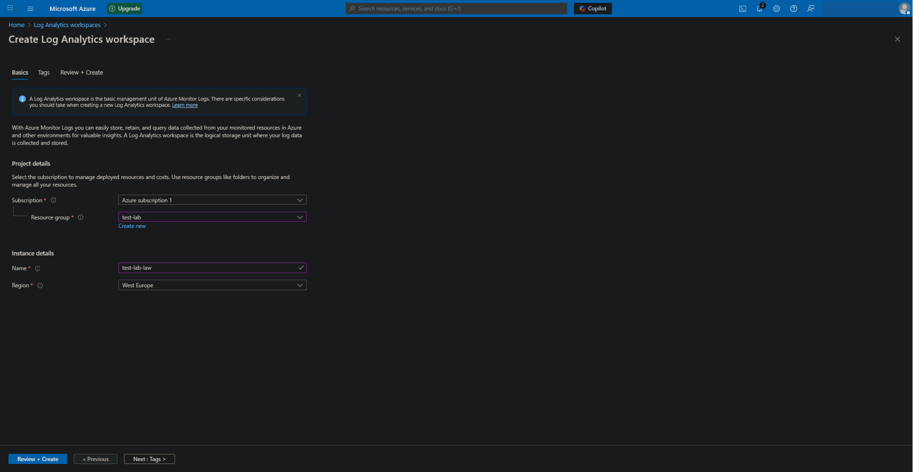
</p>

* Select the same Resource Group that you created for the virtual machine (test-lab)
* Enter the name (test-lab-law).
* Select the same Region as your virtual machine (e.g., West Europe).
* Click Review + Create.

### Step 5: Configure Microsoft Sentinel
> Search for Microsoft Sentinel and click Create.
> Microsoft Sentinel is a cloud-native SIEM that collects logs from all systems, analyzes them in real-time, and detects anomalies.
> Under the Management tab, click on "Environment settings" -> Subscription Name -> Log Analytics Workspace Name (test-lab-law).
<p align="center">
  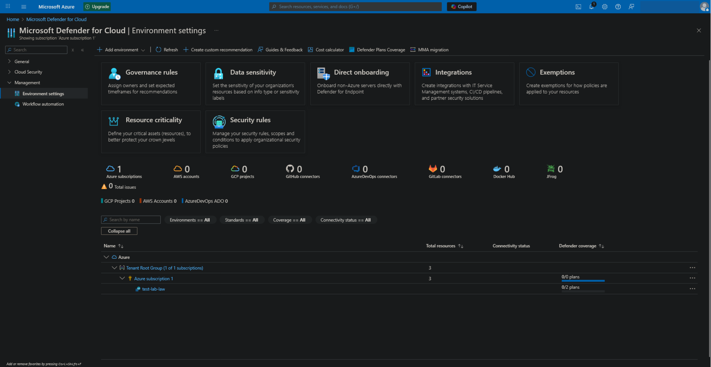
</p>

<p align="center">
  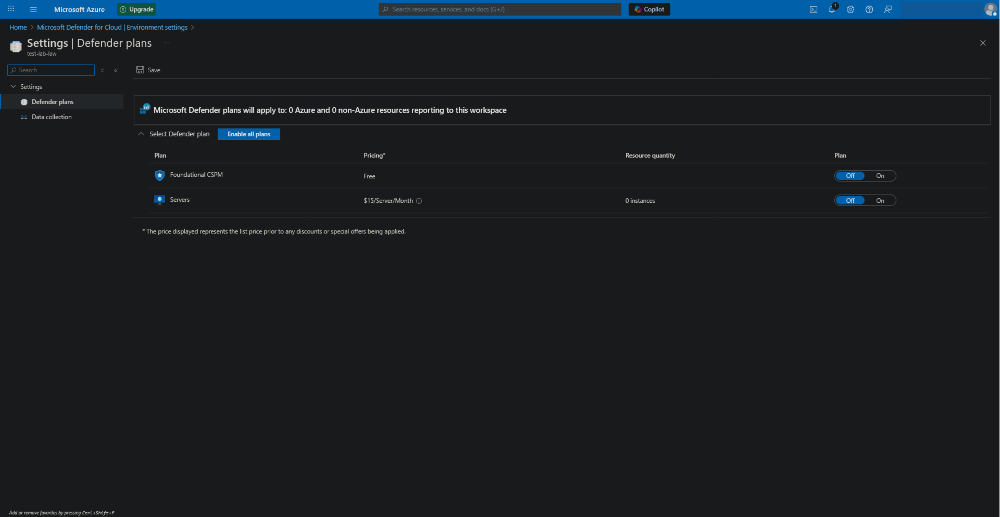
</p>

**Settings | Defender plans**

* Enable all features and save.

<p align="center">
  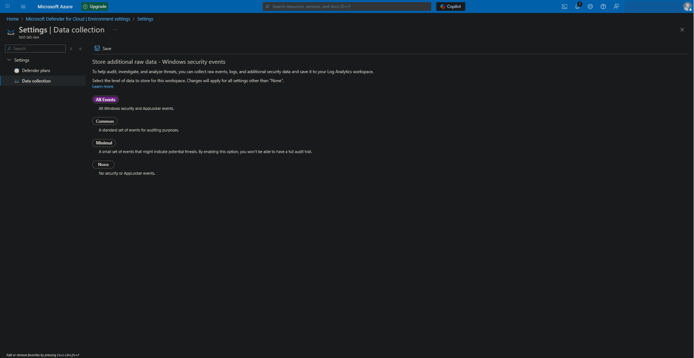
</p>

**Settings | Data collection**

* Enable "All Events" and save.

### Step 6: Configure Microsoft Sentinel
> Search for Microsoft Sentinel and click Create.
> Microsoft Sentinel is a cloud-native SIEM that collects logs from all systems, analyzes them in real-time, and detects anomalies.

<p align="center">
  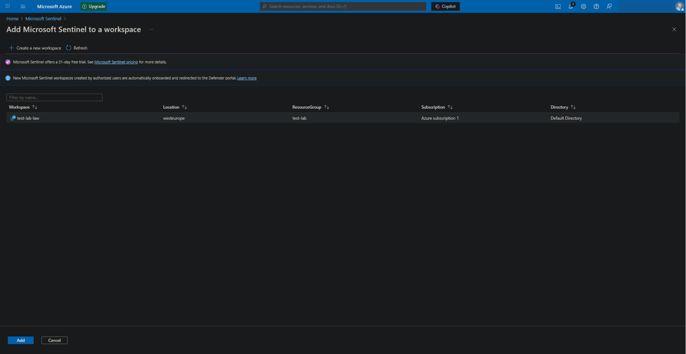
</p>

* Click Create Microsoft Sentinel
* Select the Log Analytics Workspace you created (test-lab-law) and click Add.

### Step 7: Link the VM using Syslog via AMA
> In Microsoft Sentinel, under the Configuration tab, find Data connectors. From there, go to the Content Hub, search for Syslog via AMA, and install it.
> Syslog via AMA is required to forward logs from our server to Microsoft Sentinel.

<p align="center">
  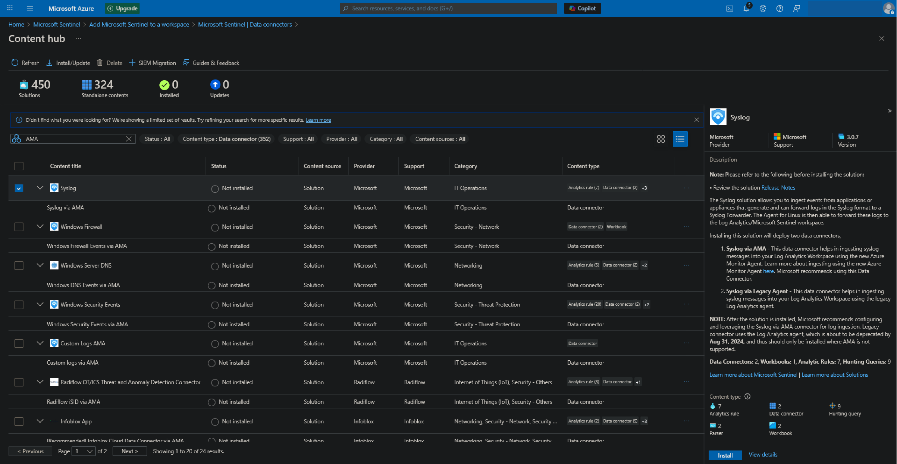
</p>

* Open your terminal and enter the command. I used WSL Ubuntu.

> First, connect to your server. Enter your username and the public IP address of your virtual machine.
```bash
ssh USERID@SERVERIP
```
> Next, connect our server to Syslog via AMA.
```bash
sudo wget -O Forwarder_AMA_installer.py https://raw.githubusercontent.com/Azure/Azure-Sentinel/master/DataConnectors/Syslog/Forwarder_AMA_installer.py && sudo python3 Forwarder_AMA_installer.py
```

* Return to your browser and click +Create data collection rule.

<p align="center">
  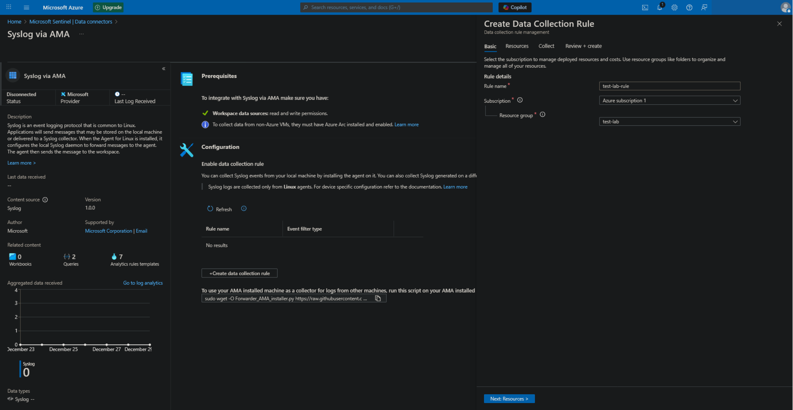
</p>

* Give your rule a name (e.g., test-lab-rule).
* Select the Resource group associated with your virtual machine.

### Step 8: Installing Cowrie
> Cowrie is a medium-interaction SSH and Telnet honeypot designed to simulate a vulnerable server, leading hackers and bots to believe they have gained access to a real system.

* Switch to the command line.
* Update the server's system.
```bash
sudo apt update && sudo apt install git python3-virtualenv python3.12-venv libssl-dev libffi-dev build-essential -y
sudo useradd -m -s /bin/bash cowrie
sudo su - cowrie
```

* Install Cowrie. If you are interested, you can find the official documentation on the Cowrie website.

```bash
git clone http://github.com/cowrie/cowrie
cd ./cowrie
python3 -m venv cowrie-env
source cowrie-env/bin/activate
python -m pip install --upgrade pip
python -m pip install -e .
```

* Link Cowrie with Microsoft Sentinel so that Cowrie writes its events to the system log.
* Create a configuration file.

```bash
cp etc/cowrie.cfg.dist etc/cowrie.cfg
```

* Open it using nano, locate the output_syslog section, and modify the values.

```bash
[output_localsyslog]
enabled = true
facility = AUTHPRIV
format = text
```

* Save the changes, exit nano, start Cowrie, deactivate the virtual environment, and log out of the cowrie account.

```bash
cowrie start
deactivate
exit
```

### Step 9: Changing the SSH Port to 22222

* Change the SSH connection port to use it for future access.
* Open the SSH configuration file.

```bash
sudo nano /etc/ssh/sshd_config
```

* Find the line #Port 22. Remove the comment symbol # and change 22 to 22222.
* Save and exit.
* Restart the SSH system service.

```bash
sudo systemctl restart ssh
```

* Allow inbound access to the virtual machine on port 22222 with Priority 200.
* Redirect all incoming traffic from port 22 to port 2222, where Cowrie is listening.

```bash
sudo ufw allow 22222/tcp
sudo iptables -t nat -A PREROUTING -p tcp --dport 22 -j REDIRECT --to-port 2222
```

### Step 10: Testing Cowrie Functionality

* Verify Cowrie is running and monitor the logs.

```bash
sudo ss -tulpn | grep :2222
sudo tail -f /var/log/auth.log | grep cowrie
```

* Open a terminal from a different machine and connect to the server via SSH using a random username and password.
> Cowrie will allow you to log in with any username and password, but permissions within its virtual system will be limited.

```bash
ssh root@98.64.89.36
```

* Enter any commands and watch the logs on the server. Cowrie tracks every command entered.

<p align="center">
  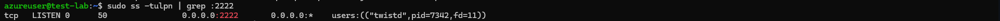
</p>

<p align="center">
  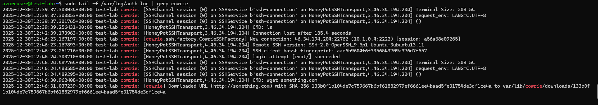
</p>

* Switch back to your browser and check the logs in Microsoft Sentinel.
* Enter the code below to query specific logs from the server.

```bash
Syslog
| where ProcessName == "cowrie"
| where SyslogMessage has_any("New connection", "login attempt", "CMD", "Connection lost", "Remote SSH version")
| extend 
    AttackerIP = extract(@"([0-9]{1,3}\.[0-9]{1,3}\.[0-9]{1,3}\.[0-9]{1,3})", 1, SyslogMessage),
    SessionID = extract(@"\[session: ([a-f0-9]+)\]", 1, SyslogMessage)
| project TimeGenerated, AttackerIP, SessionID, SyslogMessage, Computer
| order by TimeGenerated desc
```

<p align="center">
  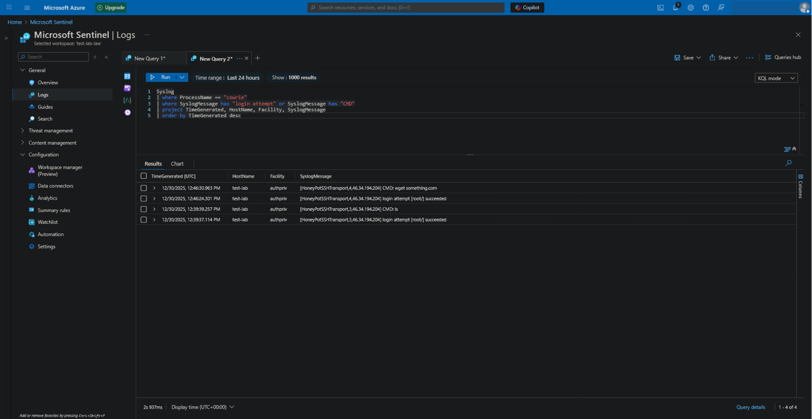
</p>

> Here, we can observe the commands that bots are entering into our honeypot.

### Step 11: Configuring the Dashboard in Microsoft Sentinel Workbooks

* Search for Workbooks in the Azure portal.
* Click on Workbook and create a new one.
* Click the settings icon and add a data source.
* Select your resource group (test-lab).
* Select test-lab-law in the Log Analytics workbook.
* Paste the code below into the query window.


```bash
Syslog
| where ProcessName == "cowrie"
| where SyslogMessage has_any("New connection", "login attempt", "CMD")
| extend AttackerIP = extract(@"([0-9]{1,3}\.[0-9]{1,3}\.[0-9]{1,3}\.[0-9]{1,3})", 1, SyslogMessage)
| where isnotempty(AttackerIP)
| extend location = geo_info_from_ip_address(AttackerIP)
| extend Country = tostring(location.country),
         State = tostring(location.state),
         City = tostring(location.city),
         Latitude = todouble(location.latitude),
         Longitude = todouble(location.longitude)
| summarize AttackCount = count() by AttackerIP, Country, City, Latitude, Longitude
| where isnotempty(Latitude) and isnotempty(Longitude)
```


<p align="center">
  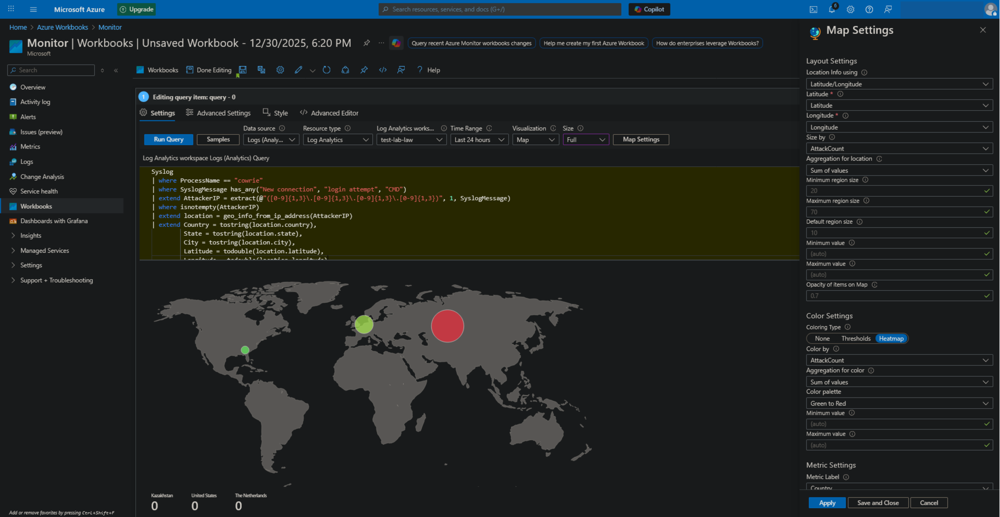
</p>

* In Visualization, select Map.
* Configure the map settings as follows:
* Location info using: Latitude/Longitude.
* Latitude: Latitude.
* Longitude: Longitude.
* Size by: event_count.
* Aggregation for location: Sum of values.
* Coloring Type: Heatmap.
* Clor by: AttackCount.
* Aggregation for color: Sum of values.
* Color palette: Green to Red.
* Metric Label: Country.
* Metric Value: AttackCount.

## Done! Congratulations! You have successfully set up a Cowrie honeypot on Microsoft Azure and are tracking logs using Microsoft Sentinel.


